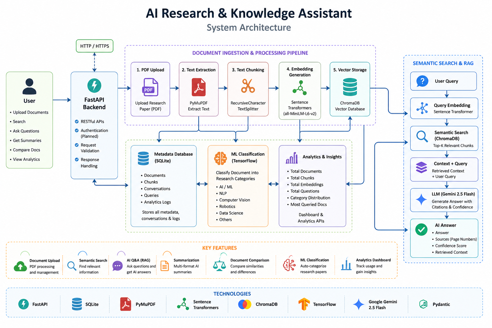
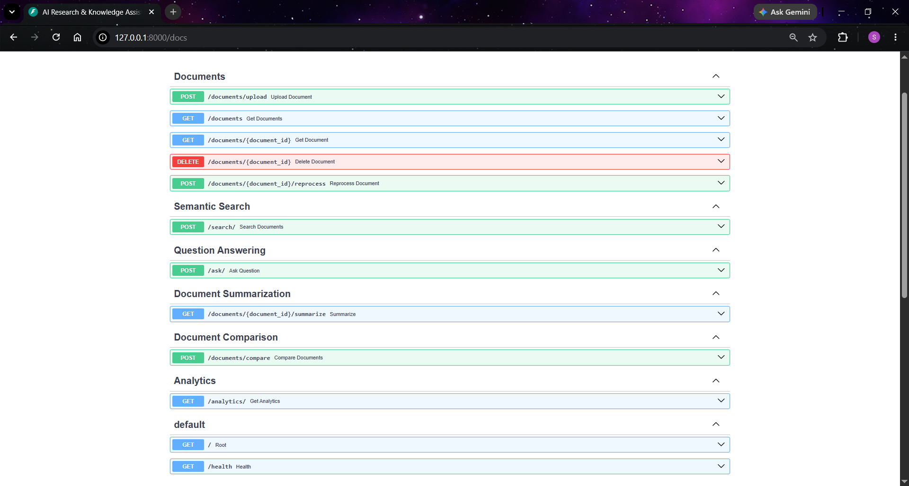
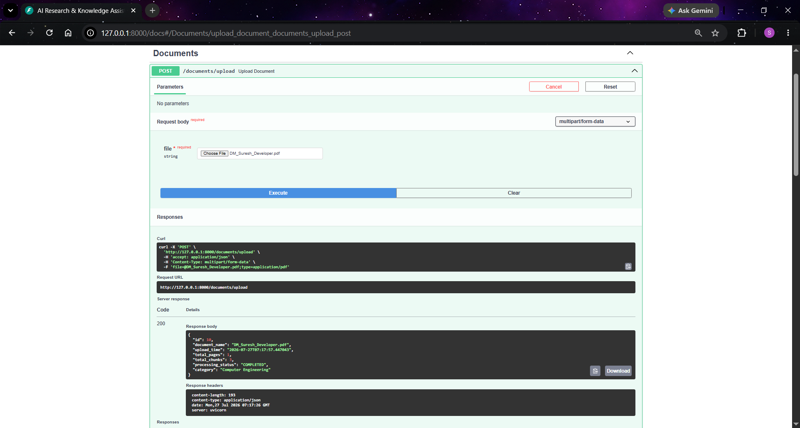
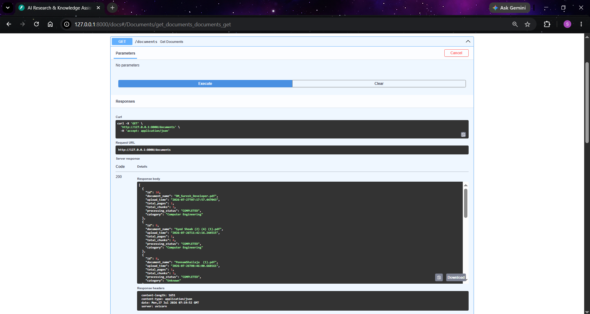
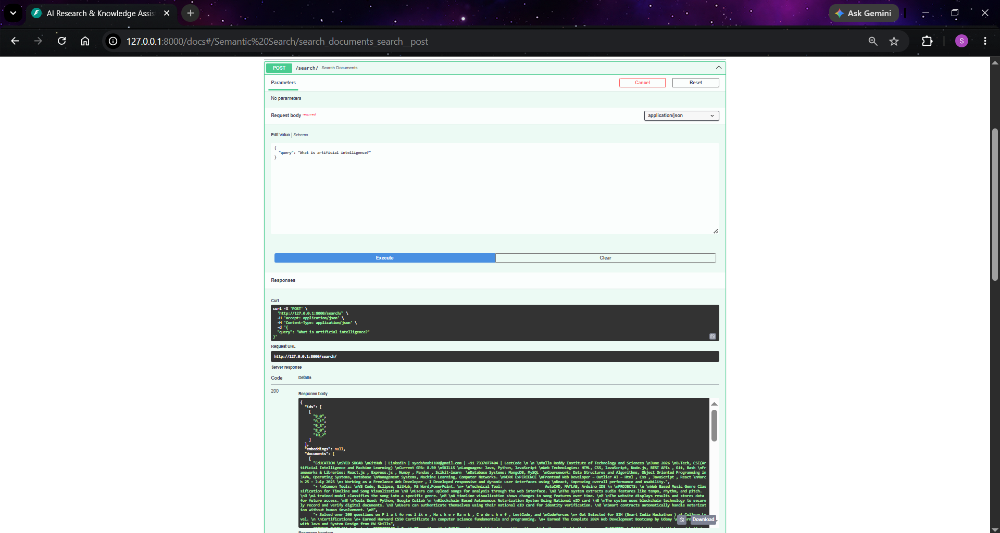
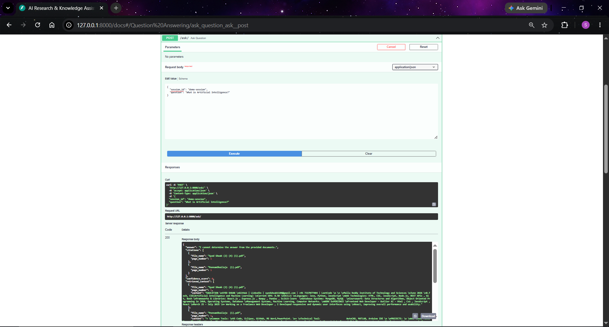
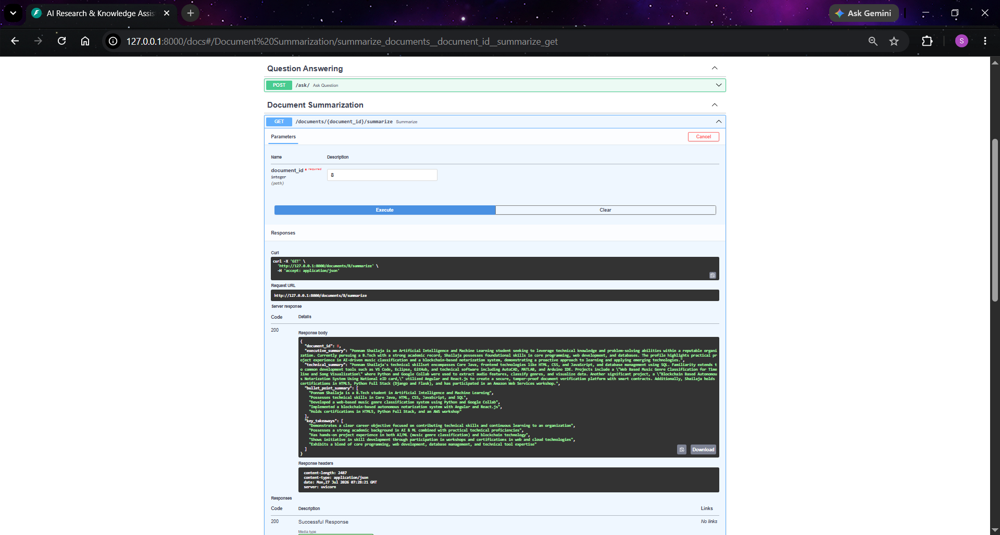
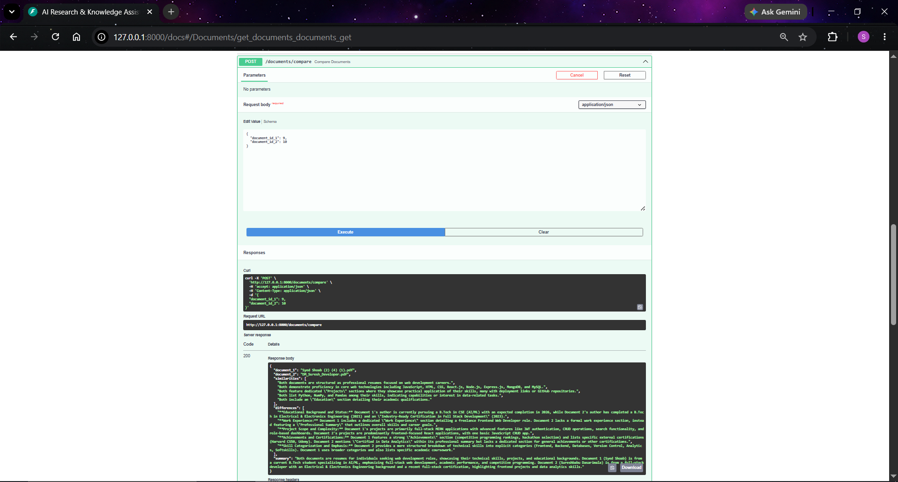
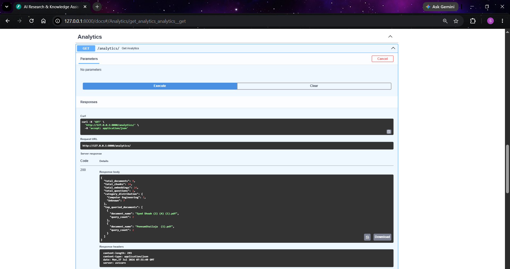

# AI Research & Knowledge Assistant

An AI-powered backend application for intelligent document understanding using **FastAPI**, **ChromaDB**, **Sentence Transformers**, **Google Gemini**, and **TensorFlow**.

The system enables users to upload research papers, perform semantic search, ask questions using Retrieval-Augmented Generation (RAG), generate AI-powered summaries, compare multiple documents, classify documents using Machine Learning, and analyze document usage.

---

# Features

## Document Management

- Upload PDF research papers
- Extract text using PyMuPDF
- Automatic document metadata extraction
- Delete uploaded documents
- Reprocess existing documents

---

## Semantic Search

- SentenceTransformer embeddings
- ChromaDB vector database
- Context-aware semantic retrieval
- Similarity-based document search

---

## AI Question Answering (RAG)

- Google Gemini 2.5 Flash
- Retrieval-Augmented Generation
- Conversation memory
- Source citations
- Page number references
- Retrieved context
- Confidence score
- Hallucination prevention

---

## AI Summarization

- Executive Summary
- Technical Summary
- Bullet Point Summary
- Key Takeaways

---

## Document Comparison

Compare two research papers and generate

- Summary
- Similarities
- Differences

---

## Machine Learning

TensorFlow document classification

Supported categories include

- Artificial Intelligence
- Machine Learning
- Deep Learning
- Natural Language Processing
- Computer Vision
- Robotics
- Data Science

---

## Analytics

Dashboard statistics include

- Total Documents
- Total Chunks
- Total Embeddings
- Total Questions
- Category Distribution
- Most Queried Documents

---

# Tech Stack

## Backend

- FastAPI
- Python 3.12
- SQLAlchemy
- SQLite

## AI

- Google Gemini 2.5 Flash
- Sentence Transformers
- ChromaDB

## Machine Learning

- TensorFlow
- Keras

## PDF Processing

- PyMuPDF

## Embeddings

- all-MiniLM-L6-v2

## Testing

- Pytest

---

# Project Structure


# Installation

## Clone Repository

```bash
git clone https://github.com/your-username/ai-research-knowledge-assistant.git
```

```bash
cd ai-research-knowledge-assistant
```

---

## Create Virtual Environment

### Windows

```bash
python -m venv venv
```

Activate

```bash
venv\Scripts\activate
```

### Linux / macOS

```bash
python3 -m venv venv
source venv/bin/activate
```

---

## Install Dependencies

```bash
pip install -r requirements.txt
```

---

## Configure Environment Variables

Create a `.env` file in the project root.

Example:

```env
GOOGLE_API_KEY=your_gemini_api_key

DATABASE_URL=sqlite:///./research.db

CHROMA_DB_PATH=data/chroma
```

---

## Run Application

```bash
uvicorn main:app --reload
```

Server

```
http://127.0.0.1:8000
```

Swagger UI

```
http://127.0.0.1:8000/docs
```

ReDoc

```
http://127.0.0.1:8000/redoc
```

---

# API Endpoints

## Document APIs

| Method | Endpoint | Description |
|----------|----------|-------------|
| POST | `/documents/upload` | Upload PDF |
| GET | `/documents` | List Documents |
| GET | `/documents/{id}` | Get Document |
| DELETE | `/documents/{id}` | Delete Document |
| POST | `/documents/{id}/reprocess` | Reprocess Document |

---

## Search APIs

| Method | Endpoint | Description |
|----------|----------|-------------|
| POST | `/search` | Semantic Search |

---

## Question Answering

| Method | Endpoint | Description |
|----------|----------|-------------|
| POST | `/ask` | Ask Questions using RAG |

---

## Summarization

| Method | Endpoint | Description |
|----------|----------|-------------|
| GET | `/summary/{document_id}` | AI Summary |

---

## Document Comparison

| Method | Endpoint | Description |
|----------|----------|-------------|
| POST | `/compare` | Compare Two Documents |

---

## Analytics

| Method | Endpoint | Description |
|----------|----------|-------------|
| GET | `/analytics` | Dashboard Statistics |

---

# Environment Variables

| Variable | Description |
|------------|-------------|
| GOOGLE_API_KEY | Gemini API Key |
| DATABASE_URL | SQLite Database |
| CHROMA_DB_PATH | ChromaDB Storage Path |

---

# Assumptions

- Input documents are PDF research papers.
- One embedding is generated for every text chunk.
- ChromaDB stores embeddings locally.
- Gemini is available during question answering and summarization.
- TensorFlow model has been pre-trained before inference.
- Uploaded documents are processed sequentially.

---

# Design Decisions

- **FastAPI** was chosen for its high performance and automatic OpenAPI documentation.
- **SQLite** is used for lightweight metadata storage.
- **ChromaDB** provides efficient semantic vector retrieval.
- **Sentence Transformers** generate dense embeddings for semantic search.
- **Gemini 2.5 Flash** powers question answering, summarization, and comparison.
- **TensorFlow** performs document classification independently from the RAG pipeline.
- Conversation history is persisted in SQLite to support follow-up questions.

# System Architecture

```
                        User
                          │
                          ▼
                  FastAPI Backend
                          │
      ┌───────────────────┼───────────────────┐
      ▼                   ▼                   ▼
  SQLite DB           ChromaDB          Google Gemini
(Document Metadata)  (Embeddings)        (LLM APIs)
      │                   │                   │
      ▼                   ▼                   ▼
 TensorFlow      Sentence Transformers   AI Responses
 Classification       Embeddings
      │
      ▼
  PyMuPDF Text Extraction
      │
      ▼
 Uploaded PDF Documents
```

---

# RAG Workflow

```
Upload PDF
      │
      ▼
Extract Text (PyMuPDF)
      │
      ▼
Split into Chunks
      │
      ▼
Generate Embeddings
      │
      ▼
Store in ChromaDB
      │
      ▼
User Question
      │
      ▼
Generate Query Embedding
      │
      ▼
Retrieve Relevant Chunks
      │
      ▼
Gemini 2.5 Flash
      │
      ▼
Answer + Citations + Confidence Score
```

---

# Machine Learning Workflow

```
Upload PDF
      │
      ▼
Extract Complete Text
      │
      ▼
TensorFlow Model
      │
      ▼
Predict Research Category
      │
      ▼
Store Category in Database
```

---

# Testing

Unit testing was performed using **Pytest**.

Run all tests:

```bash
pytest -v
```

Example output:

```
==========================
17 passed
==========================
```

---

# Screenshots

Include screenshots of the following pages:

- Swagger UI
- Document Upload
- Semantic Search
- Question Answering
- Document Summary
- Document Comparison
- Analytics Dashboard
- ChromaDB Storage (optional)

Example:

```
docs/
├── upload.png
├── search.png
├── qa.png
├── summary.png
├── compare.png
├── analytics.png
```

---

# Limitations

- Supports PDF documents only.
- Uses a local SQLite database.
- ChromaDB is configured for local persistence.
- Gemini API requires an active internet connection.
- TensorFlow model supports predefined research categories.

---

# Future Enhancements

- User Authentication
- Multi-user Workspace
- Hybrid Search (Keyword + Semantic)
- OCR Support for Scanned PDFs
- Multiple LLM Support
- Redis Caching
- Docker Deployment
- PostgreSQL Integration
- Cloud Storage Support
- Background Document Processing
- Streaming Responses
- Advanced Analytics Dashboard

---

# Performance Highlights

- FastAPI asynchronous API framework
- Local vector search using ChromaDB
- Semantic retrieval with Sentence Transformers
- Google Gemini powered RAG
- TensorFlow document classification
- SQLite metadata storage
- Conversation memory support
- Confidence score for AI responses
- Source citations with page numbers

---

# License

This project was developed as part of an **AI Research & Knowledge Assistant** assignment for educational purposes.

---

# Author

**Saikiran Sangisetti**

Full Stack Developer

Technologies:

- Python
- FastAPI
- SQLAlchemy
- TensorFlow
- ChromaDB
- Sentence Transformers
- Google Gemini
- SQLite
- PyMuPDF

# System Architecture



# API Screenshots

## Swagger UI



---

## Upload Document



---

## Document List



---

## Semantic Search



---

## Question Answering



---

## Document Summary



---

## Document Comparison



---

## Analytics

